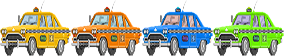

# Pizza-time!

## Overview
This is a side-scrolling browser game project I made, called Pizza Time! I was looking for a theme for this game and saw one of the original early-00's Spider-man movies on my tv, so the idea hit me to bring a scene from those movies into my game (For the full context, I included a clip of it in the page!). The premise of the game is to avoid wild taxis flying towards you, while you deliver pizzas to customers on the street - who (sometimes) pay you tips! If you rake in at least $500 in tips, you win the game. If you hit enough taxis, you lose the game. This was a great exercise to build my skills in HTML, CSS, and JavaScript - while simultaneously having a lot of fun with adding some creative flair to the game.

## How it works
Pizza Time! Relies on several looping animations and collision detectors in order to make the game function. The taxis are grouped two to a lane. Each taxi runs at a certain speed, with enough variety in between speeds and starting positions to make it challenging for the player to avoid - but also leave room for an agile player to escape damage (most of the time). The other looping animation group is our customers. There are only three customers, but (like the cars) their appearance is randomly selected from our sprite asset. They populate the game screen often enough to consistently collide with the player, but often at the risk of the player facing down an incoming taxi.

## Collision
The taxis and the customers have similar collision logic - which output respective values (taxis - damage, customers - tips). These values are processed through functions which display the information on the browser page, manipulate variables on the backend, and determines if the player has a game over event or if they've won the game.

## Key Elements
1. The scrolling background gives the scene a nice presence. It was difficult to decide between drawing the road onto the canvas and animating it seperately, or creating a single image (which includes the road at the bottom) and scrolling it all at once. I decided to go with using one image - which was quick work using good old photoshop.

2. Multicolor taxis: using a loop which selects a randomly colored (but otherwise identical) taxi from the sprite image asset gives the game a feeling of larger scale. But, it's just a fun little trick. Here's some of that code:

function drawCars() {
    
            let carsSX = [carSX1, carSX2, carSX3, carSX4, carSX5, carSX6];
            let carsX = [carX1, carX2, carX3, carX4, carX5, carX6];
            let carsY = [carY1, carY2, carY3, carY4, carY5, carY6];

            for (i=0; i < carsX.length; i++) {
                ctx.drawImage(car, carsSX[i], 0, 71, 56, carsX[i], carsY[i], carWidth, carHeight);
            }
        }

and the image itself:

